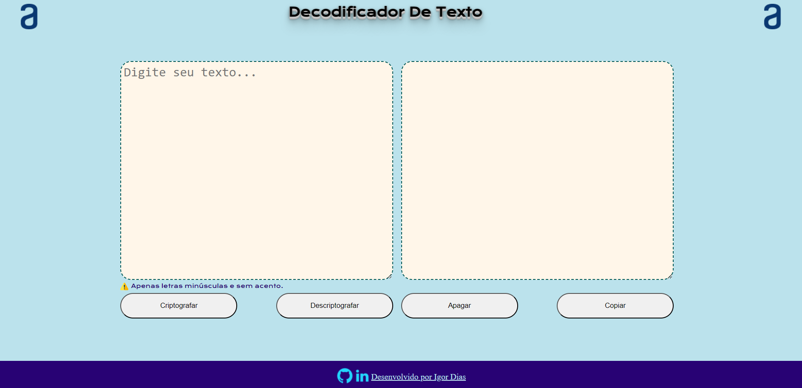
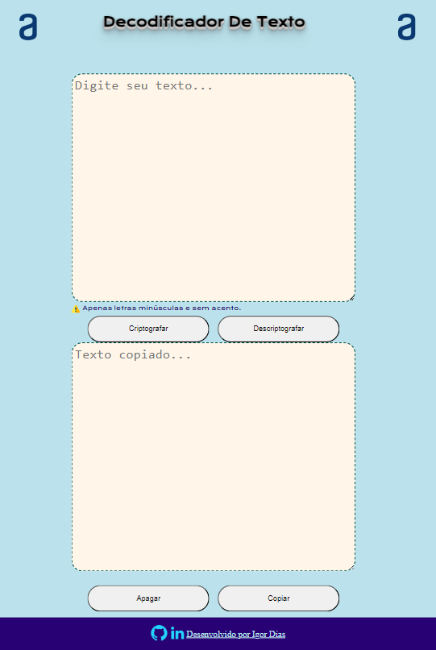
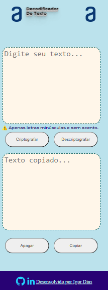

### Seja bem-vindo ao projeto Decoficador de Texto.
Esse projeto foi feito como um desafio para conclusão da formação da Turma 6 - Iniciante em programação oferecido pelo programa
Alura + ONE Oracle Next Education

### Projeto Desktop

### Projeto Tablet

### Projeto Celular

### Desenvolvido por:

### Tecnologias utilizadas

 
    
    
    
    

 
